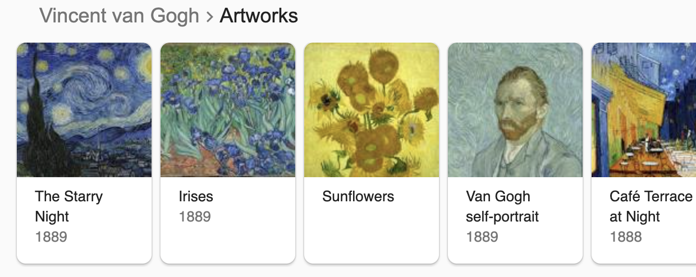
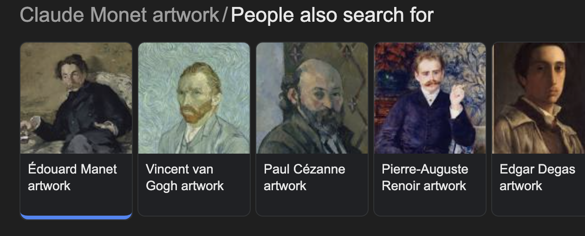
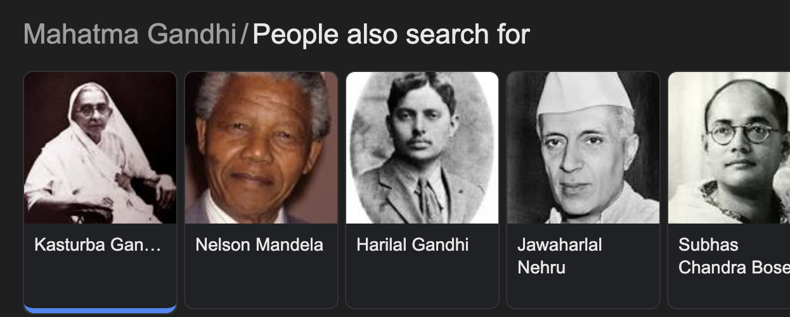

# Extract Van Gogh Paintings Code Challenge

Based on [this challenge](https://github.com/serpapi/code-challenge)

This code provides three functional examples of extracting carousel data [ name, extensions, link, image ]\*.

Examples include : 

- A. Van Gogh, 
- B. Similar Artists, 
- C. Similar Activists





# Installation

**Ruby Version 3.1.4**

```bash
rvm use 3.1.4
bundle
```

# Stack 🚀

- Ruby: Core Programming Language
- Nokogiri: HTML Parsing
- Selenium: Headless browsing
- Rspec: Testing Framework
- Rubocop: Linting

# Usage 💻

```bash
ruby bin/run_app
ruby bin/run_app files/manet_search.htm
# Or pass entire URL's!
ruby bin/run_app "https://www.google.com/search?sca_esv=70115b77c1e466d4&sxsrf=ADLYWIIQJuhaXRiHSCvUb_HAdHbxWshibA:1723636371110&si=ACC90nyVMShfJvk8i3iWUVpAMs2eabUwkd2j7s8zokOoe90DvY6az6Q6vIkMhJnm44g4flxYw_Fqw2Js4nbV6C6JNDn6lsJzewEfPZlcZfbknuDDai8WInk2TH183Sk8Ju3a5Tlb28W94Y5JdiQ6Sm6o_2sNJAKyKl9iZ261A2ZH8TxKqw9oaojVvpGWRa3ajHeI9HtA1x-lT_hFqVDKELI6etiJKFdvcQSb7LmMTHbzBrhRbUYZ9NME4Z7oA7_OsKudpSbo1laQ&q=Claude+Monet+artwork&sa=X&ved=2ahUKEwjSxPzstfSHAxWimIkEHa1UKggQs9oBKAB6BAgUEAU&biw=1406&bih=863&dpr=2"
```

# Tests 📈

```bash
  bundle exec rspec
```

# Functionality 🌻

### Nokogiri

The main obstacle was getting the images to properly encode which only happens after load. I used a headless browser Selenium and Nokogiri to parse this content. The architecture is open to extension to other carousels and perhaps variant results by way of the module nokogiri_extractor.rb.

### Regex Extractor

This is a faster process but more apt to mishap that passes the same tests but does so via the embedded \<script\> tag before the page load. The benefit is in its speed, but it lacks the ability to properly present the final image encodings. So this feature should be considered a proof of concept and incomplete.

# Index 🗃️

- `bin` - Executables
- `files` - Read files, images and json results
- `lib` - Class files
- `spec` - Testing general variants and parsing

# Strategies 👊🏼

- `Nokogiri` - More dependable than a Regex, but in some cases slower
- `Regex` - Optional alternative
